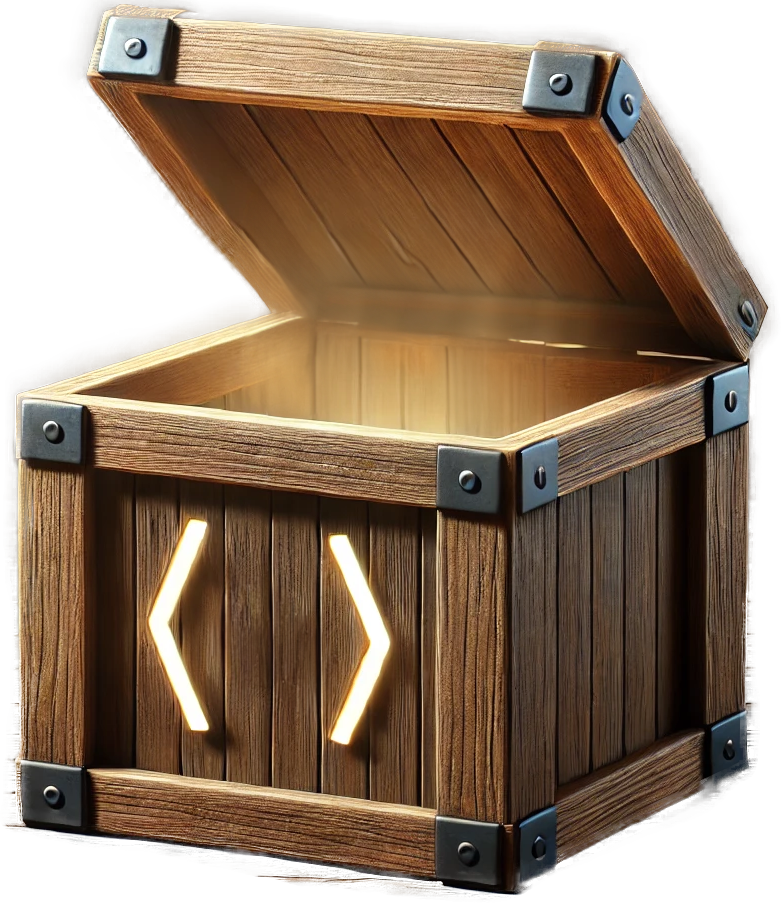

# DevCrate

 
 
 

Devcrate consists of:

* [Reusable Angular Components, Directives, Pipes, and Services](https://danielmhair.github.io/devcrate/)
* [Node Utilities](https://danielmhair.github.io/devcrate/packages/)
* [Trainings](https://danielmhair.github.io/devcrate/training/)

## Demo

The [Demo Site](https://danielmhair.github.io/devcrate/) on all available libraries

## Installation

See [Angular Packages](#angular-packages) and [Node Libraries](#node-libraries) for more information.

## Angular Packages

* [@devcrate/ngx-dc-data-sources](./app/projects/devcrate/ngx-dc-data-sources/README.md#modal)
* [@devcrate/ngx-dc-file-viewer](./app/projects/devcrate/ngx-dc-file-viewer/README.md#modal)
* [@devcrate/ngx-dc-navbar](./app/projects/devcrate/ngx-dc-navbar/README.md#modal)
* [@devcrate/ngx-dc-side-pane-list](./app/projects/devcrate/ngx-dc-side-pane-list/README.md#modal)
* [@devcrate/ngx-dc-dropdown](./app/projects/devcrate/ngx-dc-dropdown/README.md#modal)
* [@devcrate/ngx-dc-demo-card](./app/projects/devcrate/ngx-dc-demo-card/README.md#modal)
* [@devcrate/ngx-dc-utils](./app/projects/devcrate/ngx-dc-utils/README.md#modal)
* [@devcrate/ngx-dc-styles](./app/projects/devcrate/ngx-dc-styles/README.md#modal)

## Node Libraries

See [Packages README](./packages/README.md#modal) to see other packages not related to angular, but helpful for things like ESLINT settings and others

---

## Contributing

Please read [CONTRIBUTING.md](./CONTRIBUTING.md) for details on our code of conduct, and the process for submitting pull requests to us.

## Versioning

We use [SemVer](http://semver.org/) for versioning. For the versions available, see the [tags on this repository](https://github.com/danielmhair/devcrate/tags).

## Authors

* **Daniel Hair** - *Initial work* - [danielmhair](https://github.com/danielmhair)

See also the list of [contributors](https://github.com/danielmhair/devcrate/contributors) who participated in this project.

## License

This project is licensed under the MIT License - see the [LICENSE.md](./LICENSE) file for details

## Acknowledgments

* [Material Design](https://material.io/)
* [Angular](https://angular.io/)
* [Playwright](https://playwright.dev/)
* [Node](https://nodejs.org/)
* [ESLint](https://eslint.org/)
* [Airbnb Style Guide](https://github.com/airbnb/javascript)
